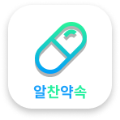

**팀페이지 주소** -> 2021년 16조 https://kookmin-sw.github.io/capstone-2021-16/

### 1. 프로젝트 소개

  **약속 관리 어플**

우리는 누군가 만날 때 약속을 정합니다.  
약속을 빠르고 편리하게 관리하고 싶지 않나요?   
'알찬약속'을 이용하세요!  
 
본 프로젝트는 학생층을 대상으로 한다. 구글계정 연동을 통한 로그인으로 개인별 계정을 이용해 간편하게 약속을 정하는 것을 목표로 한다. 
사용자는 약속을 편리하고 효율적으로 관리할 수 있고, 친구를 추가할 수 있다.

 

**기능** 

:lock: 구글계정 연동을 통한 로그인

:pushpin: 약속 신청 및 관리

:couple: 친구 추가

:calendar: 개인별 캘린더

:bell: 알림

 

**기술**

:computer: Flutter, Dart, Firebase

 

**최종 산출물**

:iphone: android, ios

 
 

### 2. Abstract 
Today, we are going through a lack of communication due to the noncontact era. This atmosphere is causing countless numbers of pessimistic social problems, the major one being depressions, also known as Corona Blue. For this reason, we have decided to develop an application to endorse connections amongst people. This project aims at students. The goal is to help people straightforwardly make appointments with others using private accounts that one can create with their personal information. The users can comfortably and rapidly make new appointments with their friends on the main page and effectively manage those appointments with various tools provided in the application.
 
 
 

### 3. 소개 영상

프로젝트 소개하는 영상을 추가하세요

 
 
 

### 4. 팀 소개

:point_right:**김현서**   
   Student ID : 20175161   
   Role : UI/UX 디자인, Front-End 개발
      

:point_right:**이선용** 
Student ID : 20163139  
Role : Front-End 개발
    

:point_right:**이주윤** 
Student ID : 20163145  
Role : DB 설계 및 구현
    

:point_right:**이헌수**  
Student ID : 20163147  
Role : Front-End 개발
        

**:point_right:함석민**  
Student ID : 20163174  
Role : PM

    
    

### 5. 사용법

소프트웨어 설치, 실행방법, 사용방법 등 추가링크로 포함

 
 
 

### 6. 기타

